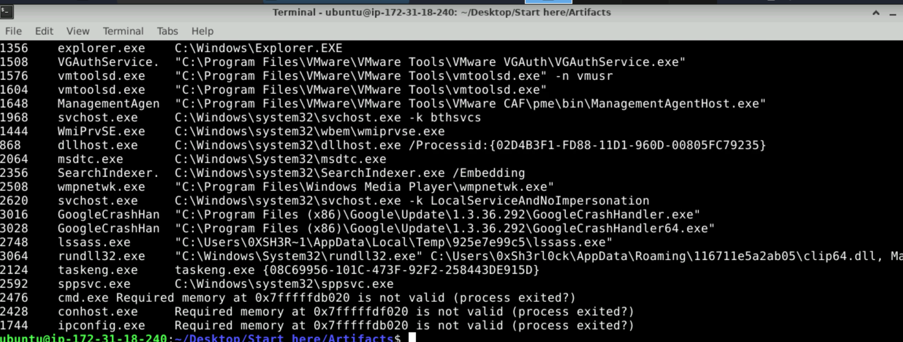
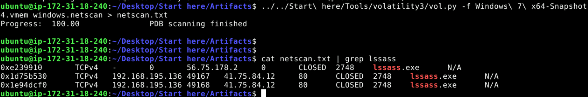
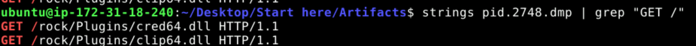
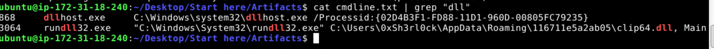
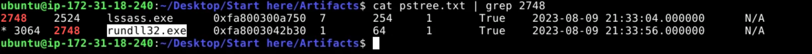
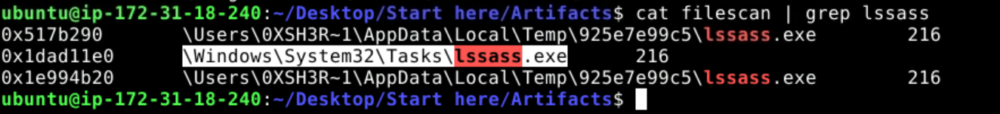

# Amadey - Memory Forensics Writeup

A memory forensics investigation of a Windows host infected with **Amadey**, a modular loader/botnet malware. Analysis was done with **Volatility 3** against a `.vmem` snapshot, plus `strings` and `grep` for HTTP artifacts.

- **Sample:** `Windows 7 x64-Snapshot4.vmem`
- **Tooling:** Volatility 3, strings, grep

---

## Q1 - Parent process behind the malicious activity

Running `windows.cmdline` shows a process named `lssass.exe` (note the double `s`, masquerading as the legitimate `lsass.exe`) executing from a user's `Temp` directory instead of `C:\Windows` or `C:\Program Files`. Legitimate `lsass.exe` only ever runs from `System32`, so this is the rogue parent.

**Answer:** `lssass.exe` (PID 2748)



---

## Q2 - Location of the rogue process

The path visible in the same `windows.cmdline` output confirms where the binary lives on disk.

**Answer:** `C:\Users\0XSH3R~1\AppData\Local\Temp\925e7e99c5\lssass.exe`

---

## Q3 - Command and Control (C2) server IP

Ran `windows.netscan` and grepped for the process name:

```bash
vol.py -f "Windows 7 x64-Snapshot4.vmem" windows.netscan > netscan.txt
cat netscan.txt | grep lssass
```

`lssass.exe` (PID 2748) has two connections to the same external IP on port 80.

**Answer:** `41.75.84.12`



---

## Q4 - Number of additional files being fetched

Dumped the process memory, then pulled HTTP `GET` requests out of it with `strings`:

```bash
vol.py -f "Windows 7 x64-Snapshot4.vmem" windows.memmap --pid 2748 --dump
strings pid.2748.dmp | grep "GET /"
```

Two distinct plugin DLLs are being downloaded from the C2:

- `/rock/Plugins/cred64.dll`
- `/rock/Plugins/clip64.dll`

**Answer:** `2`



---

## Q5 - Full path of the downloaded file used in the attack

Checked `windows.cmdline` for what actually got executed. `rundll32.exe` (PID 3064) is launched pointing at the dropped plugin.

**Answer:** `C:\Users\0xSh3rl0ck\AppData\Roaming\116711e5a2ab05\clip64.dll`



---

## Q6 - Child process spawned to execute the plugins

Used `windows.pstree` and grepped for the malware's PID (2748) to find its children.

```bash
cat pstree.txt | grep 2748
```

`rundll32.exe` (PID 3064) has parent PID 2748 (`lssass.exe`), confirming it was spawned by the malware to load the downloaded DLL.

**Answer:** `rundll32.exe`



---

## Q7 - Additional persistence mechanism

Ran `windows.filescan` and grepped for the malware name:

```bash
cat filescan | grep lssass
```

Besides the `Temp` directory copies, there is a reference under `\Windows\System32\Tasks\lssass.exe` - a **scheduled task**, a well-known Amadey persistence technique.

**Answer:** `C:\Windows\System32\Tasks` (scheduled task)



---

## Summary

| Item | Value | MITRE ATT&CK |
|------|-------|--------------|
| Malicious process | `lssass.exe` (PID 2748) | T1036 Masquerading |
| On-disk path | `C:\Users\0XSH3R~1\AppData\Local\Temp\925e7e99c5\lssass.exe` | T1036 Masquerading |
| C2 server | `41.75.84.12:80` | T1071.001 Web Protocols |
| Plugins downloaded | `cred64.dll`, `clip64.dll` | T1105 Ingress Tool Transfer |
| Loaded plugin path | `C:\Users\0xSh3rl0ck\AppData\Roaming\116711e5a2ab05\clip64.dll` | T1105 Ingress Tool Transfer |
| Child process | `rundll32.exe` (PID 3064) | T1218.011 Rundll32 |
| Persistence | Scheduled task in `\Windows\System32\Tasks` | T1053.005 Scheduled Task |
