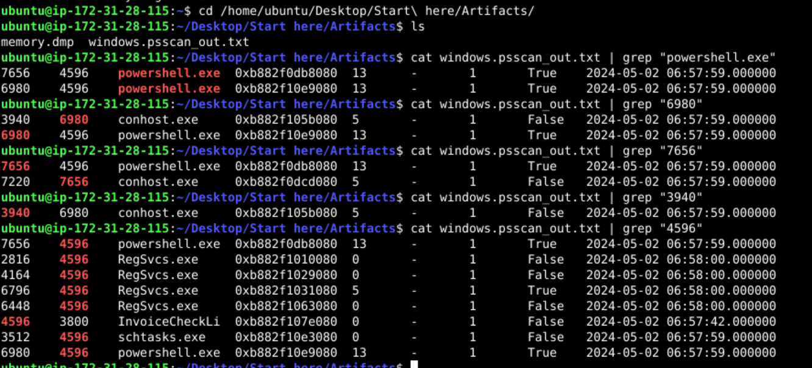
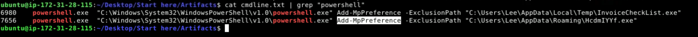
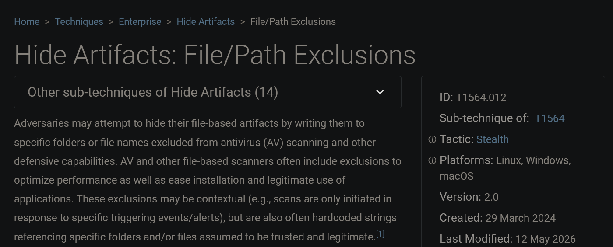

# CyberDefenders: Volatility Traces

Memory forensics investigation of a Windows host (`memory.dmp`) using Volatility 3. The provided artifacts included a pre-generated `windows.psscan` output (`windows.psscan_out.txt`), which I grepped through to trace process relationships.

**Tools:** Volatility 3 Framework 2.7.0

---

## Q1 — Parent process of the malicious PowerShell

**Question:** What is the name of the suspicious process that spawned two malicious PowerShell processes?

**Answer:** `InvoiceCheckList.exe`

I grepped the `psscan` output for `powershell.exe` and found two PIDs (6980, 7656), both with parent PID **4596**. Tracing 4596 back through the output shows the parent is `InvoiceCheckLi` (truncated `InvoiceCheckList.exe`), PID 4596.

```
cat windows.psscan_out.txt | grep "powershell.exe"
cat windows.psscan_out.txt | grep "4596"
```

- `powershell.exe` (6980) → parent 4596
- `powershell.exe` (7656) → parent 4596
- `InvoiceCheckLi` (4596) → parent 3800



---

## Q2 — Persistence executable

**Question:** Which executable is responsible for the malware's persistence?

**Answer:** `schtasks.exe`

The same parent PID (4596) also spawned `schtasks.exe` (PID 3512). Use of `schtasks` indicates the attacker created a scheduled task for persistence.

---

## Q3 — Other suspicious child process

**Question:** Aside from the PowerShell processes, what other active suspicious process originates from the same parent?

**Answer:** `RegSvcs.exe`

Grepping parent PID 4596 shows multiple `RegSvcs.exe` instances (PIDs 2816, 4164, 6796, 6448). `RegSvcs.exe` is a legitimate .NET binary commonly abused for process injection / defense evasion (a LOLBIN).

---

## Q4 — Defense-evasion cmdlet

**Question:** What PowerShell cmdlet was used by the malware for defense evasion?

**Answer:** `Add-MpPreference`

Extracted with `windows.cmdline`. `Add-MpPreference -ExclusionPath` adds a path to Windows Defender's exclusion list so the specified files are skipped during scanning.

```
vol -f memory.dmp windows.cmdline > cmdline.txt
cat cmdline.txt | grep "powershell"
```

```
powershell.exe ... Add-MpPreference -ExclusionPath "C:\Users\Lee\AppData\Local\Temp\InvoiceCheckList.exe"
powershell.exe ... Add-MpPreference -ExclusionPath "C:\Users\Lee\AppData\Roaming\HcdmIYYf.exe"
```



---

## Q5 — Excluded applications

**Question:** Which two applications were excluded by the malware from Defender's settings?

**Answer:** `InvoiceCheckList.exe`, `HcdmIYYf.exe`

From the two `Add-MpPreference -ExclusionPath` commands above:

- `C:\Users\Lee\AppData\Local\Temp\InvoiceCheckList.exe`
- `C:\Users\Lee\AppData\Roaming\HcdmIYYf.exe`

---

## Q6 — MITRE ATT&CK sub-technique

**Question:** What sub-technique ID describes an adversary configuring exempted folders or path exclusions to hide malicious payloads from security inspection?

**Answer:** `T1564.012` — Hide Artifacts: File/Path Exclusions

This sub-technique covers hiding file-based artifacts in folders/paths excluded from AV scanning.



> Note: This overlaps with T1562.001 (Impair Defenses: Disable or Modify Tools), which is where the act of *modifying* Defender via `Add-MpPreference` maps. The question's wording ("exempted folders or path exclusions to hide payloads") points to T1564.012. Confirm against the challenge's accepted answer.

---

## Q7 — User account

**Question:** Which user account is linked to the malicious processes?

**Answer:** `Lee`

The exclusion paths reference `C:\Users\Lee\...`, confirming the malicious processes ran under the local user **Lee**.

---

## Summary

An `InvoiceCheckList.exe` dropper (PID 4596) spawned two PowerShell processes that added Defender exclusions for its payloads (`InvoiceCheckList.exe`, `HcdmIYYf.exe`), established persistence via `schtasks.exe`, and ran `RegSvcs.exe` for likely injection. All activity executed under user **Lee**.

| Tactic | Technique | Artifact |
|---|---|---|
| Execution | PowerShell | `powershell.exe` (6980, 7656) |
| Defense Evasion | Impair Defenses / File-Path Exclusions | `Add-MpPreference -ExclusionPath` |
| Persistence | Scheduled Task | `schtasks.exe` (3512) |
| Defense Evasion | LOLBIN abuse | `RegSvcs.exe` |
