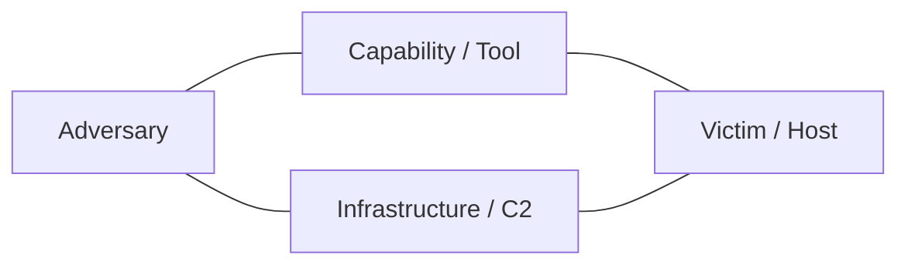
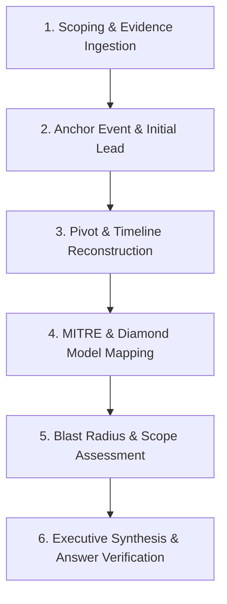

# Professional DFIR Investigation Playbook: From Question-Hunting to Root-Cause Analysis

> [!IMPORTANT]
> The biggest transition from junior lab-solver to professional Digital Forensics and Incident Response (DFIR) analyst is shifting from **Question-Driven Triage** (grepping strings to match CTF flags) to **Hypothesis-Driven Investigation** (reconstructing the complete adversary timeline, scope, and root cause).

---

## 1. Do You Need Different Files/Workflows for Different Artifacts?

**The short answer:** You need **one unified investigation framework (the spine)**, supported by **specialized artifact checklists (the lenses)**.

```
       ┌────────────────────────────────────────────────────────┐
       │         THE UNIFIED SPINE (Single Case Notebook)       │
       │  • Unified Chronological Timeline                      │
       │  • Diamond Model / MITRE ATT&CK Mapping                │
       │  • Root Cause -> Pivot -> Lateral Spread -> Objective  │
       │  • Scoping & Indicator of Compromise (IoC) Ledger      │
       └────────────────────────────────────────────────────────┘
                               ▲
        ┌──────────────────────┼──────────────────────┐
        │                      │                      │
┌───────┴────────┐     ┌───────┴────────┐     ┌───────┴────────┐
│ PCAP / Network │     │  Host / EVTX   │     │  SIEM / Logs   │
│ Triage Tactics │     │ Triage Tactics │     │ Triage Tactics │
└────────────────┘     └────────────────┘     └────────────────┘
```

- **Why it's the same thing:** Your objective never changes regardless of the artifact. You are answering the **5 Ws and 1 H** (*Who, What, Where, When, Why, and How*). Every artifact is just a different vantage point on the same chronological timeline.
- **Why artifact-specific lenses matter:** A PCAP requires protocol hierarchy analysis and stream reassembly; an EVTX log requires event ID correlations (e.g., Sysmon 1 -> 3 -> 11); memory analysis requires process tree reconstruction and injected code hunting. 

You should maintain **one central case document** for the investigation, feeding artifact-specific findings into a **single master timeline**.

---

## 2. Professional Standards & Frameworks

Industry incident responders and threat hunters rely on three foundational frameworks that complement each other:

| Framework | Core Purpose | How to Use It in Labs |
| :--- | :--- | :--- |
| **MITRE ATT&CK®** | Standardized adversary taxonomy and techniques | Maps observed actions (e.g., `cmd.exe /c whoami`) to Tactics & Techniques (e.g., `T1033 System Owner/User Discovery`). |
| **The Diamond Model of Intrusion Analysis** | Relational pivot analysis | Connects **Adversary** $\leftrightarrow$ **Capability** (malware/tools) $\leftrightarrow$ **Infrastructure** (IPs/domains) $\leftrightarrow$ **Victim** (endpoints/users). |
| **NIST SP 800-61r2 / SANS PICERL** | Incident handling lifecycle | Guides phases: Preparation $\rightarrow$ Detection & Analysis $\rightarrow$ Containment $\rightarrow$ Eradication $\rightarrow$ Recovery $\rightarrow$ Post-Incident. |



---

## 3. The 6-Phase Unified Investigation Methodology

When opening a lab on CyberDefenders, HTB Sherlocks, or TryHackMe, **do not read the questions first**. Treat it as an active engagement and execute these 6 phases:



### Phase 1: Scoping & Evidence Ingestion
- Document environment topology: hostnames, internal subnets, domain controllers, public IPs.
- Calculate evidence hashes (MD5/SHA256) for chain of custody.
- Note baseline boundaries (e.g., time range of evidence, OS version, software stack).

### Phase 2: Identify the Anchor Event (The First Lead)
Every investigation starts with a single high-fidelity anomaly:
- An alert in Splunk/Elastic (e.g., encoded PowerShell, suspicious outbound beacon).
- An unusual process execution (e.g., `certutil.exe` downloading a `.bin` file).
- An abnormal network connection (e.g., high-volume DNS requests, unknown external IP).
- Document this event's timestamp as your **Anchor $T_0$**.

### Phase 3: Pivot & Timeline Reconstruction
Using $T_0$, perform two critical pivots:
1. **Look Backward ($T_0 - \Delta t$):** *How did it get here?*
   - What parent process spawned it? (Sysmon EID 1, Event 4688)
   - What user session was active? (Event 4624 Logon Type 3 or 10)
   - Did a web server receive a POST request right before execution?
   - Was a phishing document opened or a file downloaded?
2. **Look Forward ($T_0 + \Delta t$):** *What did it do next?*
   - Network connections established? (Sysmon EID 3, Zeek `conn.log`, PCAP SYN/ACK)
   - Files written to disk? (Sysmon EID 11, Prefetch, Shimcache)
   - Persistence mechanisms created? (Run keys, scheduled tasks, new services)
   - Lateral movement attempted? (SMB, WinRM, WMI, RDP)

### Phase 4: Threat Mapping & Attribution Modeling
- Categorize each discovered activity into MITRE ATT&CK tactics (Initial Access $\rightarrow$ Execution $\rightarrow$ Persistence $\rightarrow$ Privilege Escalation $\rightarrow$ Defense Evasion $\rightarrow$ Credential Access $\rightarrow$ Discovery $\rightarrow$ Lateral Movement $\rightarrow$ C2 $\rightarrow$ Exfiltration).
- Populate Diamond Model nodes to uncover tool reuse or infrastructure patterns.

### Phase 5: Blast Radius & Scope Assessment
- Determine if the compromise was isolated to one machine or affected multiple endpoints.
- Check identity store (Active Directory): Were domain credentials dumped (`lsass`, `ntds.dit`)?
- Identify data exfiltration (outbound volume spikes, archive creation like `rar` or `7z`).

### Phase 6: Synthesis & Answer Verification
- Write a 2-3 paragraph executive summary of the incident narrative.
- Extract an IoC table (Hashes, IPs, Domains, File paths, Registry keys).
- **Now open the lab questions:** If your timeline is solid, you will find you can answer 85-95% of questions immediately without looking at hints or running target searches.

---

## 4. Modular Artifact Playbooks

### Lens A: Network Traffic Analysis (PCAP / Zeek / Wireshark)

1. **Protocol Hierarchy & Conversations:**
   - Wireshark: `Statistics -> Protocol Hierarchy` (look for unexpected protocols like IRC, raw TCP, anomalous HTTP/HTTPS traffic).
   - `Statistics -> Conversations -> IPv4 / TCP` (sort by Packets/Bytes to find data exfiltration or high-frequency beacons).
2. **DNS Triage:**
   - Filter: `dns.flags.response == 0` (review queries for DGA domains, high-entropy subdomain tunneling, or staging servers).
3. **HTTP / Web Traffic:**
   - Filter: `http.request`
   - Look for anomalous User-Agents (e.g., `curl`, `python-requests`, or default Cobalt Strike UAs).
   - Export HTTP Objects (`File -> Export Objects -> HTTP`) to recover downloaded payloads.
4. **TLS / Certificate Analysis:**
   - Filter: `tls.handshake.type == 11` (inspect Issuer CN and Subject CN for self-signed certificates or known C2 signatures).
5. **Cleartext Credentials & Transfers:**
   - Filter: `ftp`, `smtp`, `smb2`, `kerberos.CNameString`.

---

### Lens B: Host Logs & Endpoint Telemetry (Windows EVTX / Sysmon)

Key Windows & Sysmon Event IDs to correlate:

| Phase | Native Windows Security Log | Sysmon Log |
| :--- | :--- | :--- |
| **Process Creation** | `4688` (requires command-line auditing) | `1` (Process creation with Hashes, ParentCommandLine) |
| **Network Connection** | `5156` (Filtering Platform Connection) | `3` (Network connection initiated by process) |
| **Process Tampering** | - | `8` (CreateRemoteThread), `10` (ProcessAccess / LSASS dumping) |
| **File Creation** | `4663` (Object Access) | `11` (FileCreate - e.g., dropped `.exe`, `.ps1`, `.bat`) |
| **Registry / Persistence** | `4657` (Registry Modification) | `12`, `13`, `14` (Registry add/modify/rename) |
| **Authentication** | `4624` (Successful Logon: Type 2=Interactive, 3=Network, 10=RDP), `4625` (Failure) | - |
| **Script Execution** | Microsoft-Windows-PowerShell/Operational: `4104` (Script Block Logging) | - |
| **Scheduled Tasks** | `4698` (Task Created), `4702` (Task Updated) | - |
| **Service Installation** | System: `7045` (New Service Installed) | - |

---

### Lens C: Centralized SIEM Log Hunting (Splunk / Elastic)

1. **Long-tail Analysis (Frequency Sorting):**
   - Rare process executions:
     ```spl
     index=windows sourcetype="xmlwineventlog:microsoft-windows-sysmon/operational" EventCode=1
     | stats count by Image, CommandLine
     | sort + count
     ```
2. **Beaconing Detection (Regular time delta connections):**
   - Identify connections made at regular intervals (jitter analysis) to external IPs.
3. **Parent-Child Anomaly Hunting:**
   - Common web/office parents spawning CLI:
     - `ParentImage IN ("*\\w3wp.exe", "*\\httpd.exe", "*\\nginx.exe", "*\\WINWORD.EXE", "*\\EXCEL.EXE")`
     - `Image IN ("*\\cmd.exe", "*\\powershell.exe", "*\\certutil.exe", "*\\whoami.exe")`

---

### Lens D: Memory Forensics (Volatility 3)

1. **Process Discovery:**
   - `windows.pslist`: Active processes.
   - `windows.pstree`: Hierarchy of parent/child relationships.
   - `windows.psscan`: Unlinked / hidden processes (rootkits).
2. **Code Injection & Memory Anomalies:**
   - `windows.malfind`: Injected code segments with `PAGE_EXECUTE_READWRITE` permissions.
3. **Network Connections:**
   - `windows.netscan`: Sockets active at time of memory dump.
4. **Command Line & Environment:**
   - `windows.cmdline`: Exact arguments passed to executed binaries.
5. **Dumping & File Extraction:**
   - `windows.dumpfiles --pid <PID>`: Extract executable image or memory segments for static/dynamic analysis.

---

### Lens E: Malware & Binary Triage

1. **Static Analysis (Safe):**
   - Compute hashes: `sha256sum <file>`.
   - String inspection: `strings -n 8 <file> | grep -E "http|powershell|\.exe|\.dll|reg"`.
   - PE Headers: Inspect sections (`.text`, `.rdata`), compile timestamp, entropy (packed vs unpacked using DIE / Detect It Easy).
   - Obfuscation check: Search for base64 strings, XOR stubs, or embedded resources.
2. **Dynamic / Sandbox Triage:**
   - Observe dropped files, mutex creation, registry modification, DNS resolution, and outbound HTTP callbacks.

---

## 5. Ready-to-Use Investigation Case Template

Copy this markdown template into your notes at the start of any lab:

```markdown
# CASE RECORD: [Lab / Incident Name]
- **Analyst:** [Your Name]
- **Date Started:** [YYYY-MM-DD]
- **Platform:** [CyberDefenders / HTB / TryHackMe]
- **Evidence Files:** [e.g., triage.pcap, Memory.dmp, sysmon.evtx]
- **Initial Status:** Open / Active Triage

---

## 1. Executive Summary
Brief 3-5 sentence narrative of what occurred:
- Initial Access Vector:
- Attacker Identity/Profile (if known):
- Compromised Systems/Users:
- Impact & Attacker Objective:

---

## 2. Chronological Attack Timeline
| UTC Timestamp | Host / Source | Tactic / Action | Event ID / Artifact | Description & Evidence Details |
| :--- | :--- | :--- | :--- | :--- |
| YYYY-MM-DD HH:MM:SS | WEB-SRV01 | Initial Access | IIS Log / POST | Exploited CVE-XXXX-XXXX via web request |
| YYYY-MM-DD HH:MM:SS | WEB-SRV01 | Execution | Sysmon EID 1 | `w3wp.exe` spawned `cmd.exe /c whoami` |
| YYYY-MM-DD HH:MM:SS | WEB-SRV01 | C2 Beacon | Zeek conn.log | Outbound TCP connection to 198.51.100.23:443 |

---

## 3. Diamond Model & Threat Attribution
- **Adversary:** Unknown / Actor Group
- **Capabilities / Tools:** [e.g., Mimikatz, Cobalt Strike, Chisel, Custom Dropper]
- **Infrastructure:** [C2 IPs, Dynamic DNS Domains, VPS providers]
- **Victim Assets:** [Hostnames, IP addresses, targeted user accounts]

---

## 4. MITRE ATT&CK Breakdown
- **[TA0001] Initial Access:** [e.g., T1190 Exploit Public-Facing Application]
- **[TA0002] Execution:** [e.g., T1059.001 PowerShell]
- **[TA0003] Persistence:** [e.g., T1053.005 Scheduled Task]
- **[TA0004] Privilege Escalation:** [e.g., T1068 Exploitation for Privilege Escalation]
- **[TA0005] Defense Evasion:** [e.g., T1027 Obfuscated Files or Information]
- **[TA0006] Credential Access:** [e.g., T1003.001 LSASS Memory]
- **[TA0007] Discovery:** [e.g., T1087 Account Discovery]
- **[TA0008] Lateral Movement:** [e.g., T1021.002 SMB/Windows Admin Shares]
- **[TA0011] Command and Control:** [e.g., T1071.001 Web Protocols]
- **[TA0010] Exfiltration:** [e.g., T1048 Exfiltration Over Alternative Protocol]

---

## 5. Indicators of Compromise (IoCs)
### Network Indicators
| Indicator | Type | Context / Details |
| :--- | :--- | :--- |
| `198.51.100.23` | IPv4 | C2 Server / Payload Hosting |
| `update-cdn-check[.]com` | Domain | Phishing / C2 Redirection |

### Host & File Indicators
| File Name | Path | SHA256 Hash | Context |
| :--- | :--- | :--- | :--- |
| `beacon.exe` | `C:\Windows\Temp\` | `e3b0c44298fc1c149afbf4c8996fb92427ae41e4649b934ca495991b7852b855` | Staged Payload |
```

---

## 6. Practical Lab Routine: The "Blind First" Challenge

To break the habit of jumping straight to questions and hints:

1. **Folder Setup:** Set up your working directory with `evidence/`, `notes/case_notes.md`, and `extracted/`.
2. **30-45 Minute Blind Triage:** Spend the first 30-45 minutes exploring the artifact purely using the **6-Phase Methodology** above. Build the timeline, find the initial compromise, find persistence, and note C2 IPs.
3. **Open Questions as an Audit Checklist:** When you finally open the lab questions, check how many answers you already have written down in your `case_notes.md`. If a question asks something you missed, identify **which phase or artifact lens was weak** and update your checklist.
